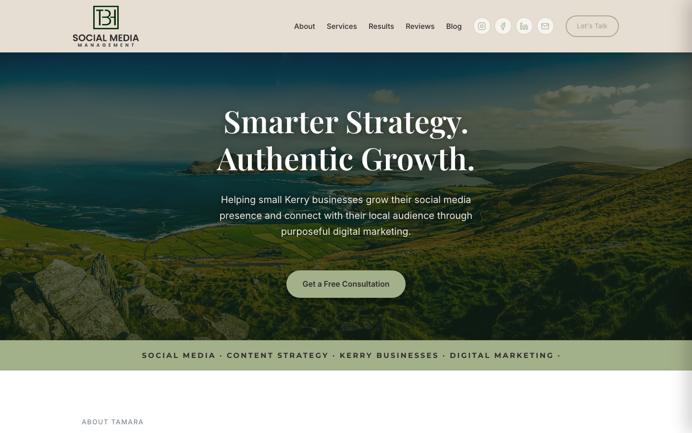

# TBH Strategy

Client project — social media management consultancy website, built and delivered under the M4rKitS.dev freelance brand.

Live site: [tbhstrategy.com](https://www.tbhstrategy.com/)



## About

TBH Strategy is a social media management consultancy based in Tralee, Co. Kerry, Ireland, helping small businesses that are great at what they do but don't have the time for their social media. This repository is the full rebuild of their website, delivered as a freelance client project under my M4rKitS.dev brand.

The site replaces a self-built Squarespace site with a custom design that actually reflects the client's brand and includes functionality she didn't have before: a proper contact form and a blog built for SEO.

## What was delivered

- **Full custom design** — a sage-green palette matched to the client's existing brand identity, not a template
- **Blog system** — built for long-form, SEO-focused articles (content written by the client, markup and structure by me)
- **Working contact form**, replacing a site with no reliable way for leads to reach out
- **Domain migration** — moved tbhstrategy.com from Squarespace to Cloudflare, without losing the client's existing Google Workspace email or her existing Google Analytics (GA4) property
- **Real analytics from day one** — traffic data connected and working immediately after launch, not added as an afterthought

## Tech stack

| Layer | Technology |
| :--- | :--- |
| **Frontend / Architecture** | Semantic HTML5 & Vanilla CSS (Custom Design System, CSS Variables, Flexbox/Grid) |
| **Client Scripting** | Vanilla JavaScript (interactive components, cookie consent banner) |
| **Contact Form** | [EmailJS](https://www.emailjs.com/) (client-side form submissions) |
| **Hosting / runtime** | [Cloudflare Workers](https://workers.cloudflare.com/) (Static Assets) |
| **Domain / DNS** | Cloudflare (migrated from Squarespace) |
| **Analytics** | Google Analytics 4 (with GDPR consent banner) |
| **Email** | Google Workspace (client's own, preserved through migration) |

## Project structure

```text
.
├── assets/                  # Brand photography, logos, favicons, and screenshots
│   ├── favicon/             # Multi-device favicons and icons
│   ├── hero-bg-kerry.jpg    # Hero banner photography
│   ├── readme-screenshot.png# Desktop viewport screenshot
│   ├── tamara.jpg           # About section portrait
│   └── tbh_trans.png        # Brand logo
├── blog/                    # Long-form, SEO-focused articles
│   └── ai-vs-social-media-manager.html
├── color-variants/          # Palette exploration and preview renders
├── index.html               # Main website landing page
├── preview-colors.html      # Color palette comparison tool
├── robots.txt               # Crawler directives
├── sitemap.xml              # Search engine sitemap
├── style.css                # Global styles, variables, and responsive layout
├── wrangler.jsonc           # Cloudflare Workers configuration (static assets)
├── .assetsignore            # Cloudflare deployment ignore list
└── .gitignore
```

## Client

- **Business:** TBH Strategy — social media management for small businesses
- **Location:** Tralee, Co. Kerry, Ireland
- **Site:** [tbhstrategy.com](https://www.tbhstrategy.com/)

## Delivered by

Built under [M4rKitS.dev](https://m4rkits.dev/) — freelance web development.

- **Email:** contact@m4rkits.dev
- **GitHub:** [@M4rKitS](https://github.com/M4rKitS)
